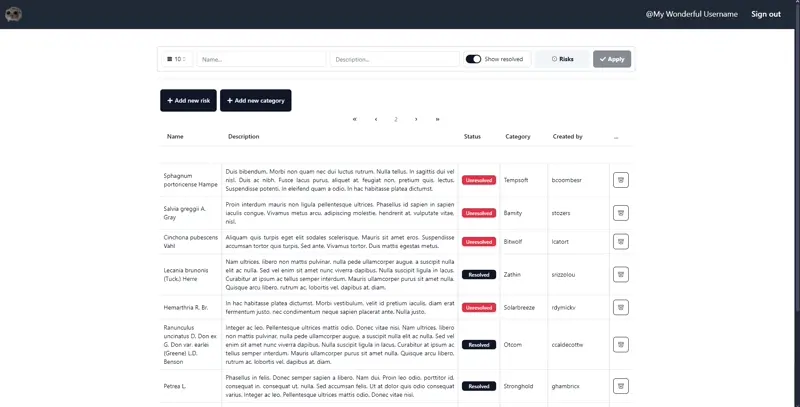

# Risk Management Solutions - Frontend

This project is a frontend application for the Risk Management Solutions project. 

## Installation

1. Clone this repository:

    ```bash
    git clone https://github.com/CatOfJupit3r/riskm-tt-front.git
    ```

2. Install dependencies:

    ```bash
    npm install
    ```

3. Create a `.env` file in the root directory of the project and populate it with the variables from `.env.example`.


## Environment Variables

The following environment variables are required for the application to run:

```dotenv
REACT_APP_BACKEND_URL= /* URL of the backend API */
```


## Development

This repository uses `gql.tada` library to for type-safe GraphQL queries. 

In order for comfortable development, it is recommended to **REMOVE** the `src/graphql/schema.graphql` file and change these files:

- `tsconfig.json`
```json
{
    ...
    "compilerOptions" : {
        ...
        "plugins": [
            {
                "name": "gql.tada/ts-plugin",
                "schema": /* link to your backend */,
                "tadaOutputLocation": "./src/models/graphql-env.d.ts"
            }
        ]
    }
}
```

- `graphql.config.yml` (if you are using it)
```yaml
...
schema: /* link to your backend */
...
```

This ensures that any changes to the schema on the backend are reflected in the frontend.

But when committing changes, remember to not include these changes in the commit.

## Screenshots

### Login
<p align="center">
  
</p>


### Overview of Interface

<p align="center">
  
</p>

### Filters

<p align="center">
  
</p>

### Add new Category

<p align="center">
  
</p>

### Risk Manipulations

#### Add New Risk

<p align="center">
  
</p>

#### Inline Editing of Risk

<p align="center">
  
</p>

#### Resolving Risks

<p align="center">
  
</p>

#### Removal of Risks

<p align="center">
  
</p>


## Available Scripts

In the project directory, you can run:

### `npm run start`

Runs the app in the development mode.\
Open [http://localhost:3000](http://localhost:3000) to view it in the browser.

The page will reload if you make edits.\
You will also see any lint errors in the console.

### `npm run build`

Builds the app for production to the `build` folder.\
It correctly bundles React in production mode and optimizes the build for the best performance.

The build is minified and the filenames include the hashes.\
Your app is ready to be deployed!


## Afterword

It's been very strange using GraphQL. Quite an experience, especially working my way through the type-safety.
Although I was very lucky to stumble upon `gql.tada` library, which made the process a lot easier.

<p align="center">
  
</p>
